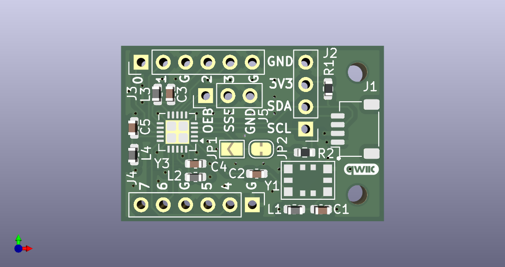

This repository contains the KiCad files for an Si5351 breakout board. It uses the Si5351A-B-GM in a QFN form factor to obtain 8 clock outputs. It is suitable for retrofitting a T41-EP V12 RF board to obtain separate RX and TX VFOs.

